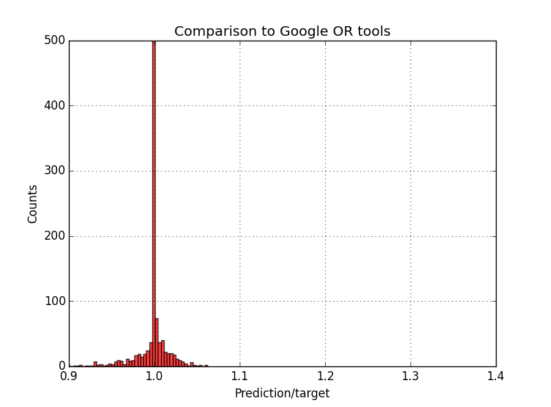

# Neural Combinatorial Optimization with RL

TensorFlow implementation of [Neural Combinatorial Optimization with Reinforcement Learning](http://arxiv.org/abs/1611.09940) for the Traveling Salesman Problem (TSP) and the TSP with Time Windows (TSP-TW)


The Neural Network consists in a RNN encoder-decoder with an attention module connecting the decoder to the encoder (via a "pointer"). The model is trained by Policy Gradient ([Reinforce](https://link.springer.com/article/10.1007/BF00992696), 1992).

## Requirements

- Python 2.7 or 3.5
- [TensorFlow 1.0.1](https://www.tensorflow.org/install/)
- [tqdm](https://pypi.python.org/pypi/tqdm)
- [Google OR tools](https://developers.google.com/optimization/) - optional reference solver (main.py, dataset.py)

## Architecture

(under progress)

## Usage

### TSP

- To train a (2D TSP20) model from scratch (data is generated on the fly):
```
> python main.py --max_length=20 --inference_mode=False --restore_model=False --save_to=20/model --log_dir=summary/20/repo
```

NB: Just make sure ./save/20/model exists (create folder otherwise)

- To visualize training on tensorboard:
```
> tensorboard --logdir=summary/20/repo
```

- To test a trained model:
```
> python main.py --max_length=20 --inference_mode=True --restore_model=True --restore_from=20/model
```

### TSP-TW

- To pretrain a (2D TSPTW20) model with infinite travel speed from scratch:
```
> python main.py --inference_mode=False --pretrain=True --restore_model=False --speed=1000. --beta=3  --save_to=speed1000/n20w100 --log_dir=summary/speed1000/n20w100
```


- To fine tune a (2D TSPTW20) model with finite travel speed:
```
> python main.py --inference_mode=False --pretrain=False --kNN=5 --restore_model=True --restore_from=speed1000/n20w100 --speed=10.0 --beta=3 --save_to=speed10/s10_k5_n20w100 --log_dir=summary/speed10/s10_k5_n20w100
```

NB: Just make sure save_to folders exist

- To visualize training on tensorboard:
```
> tensorboard --logdir=summary/speed1000/n20w100
```
```
> tensorboard --logdir=summary/speed10/s10_k5_n20w100
```

- To test a trained model with finite travel speed on Dumas instances (in the benchmark folder):
```
> python main.py --inference_mode=True --restore_model=True --restore_from=speed10/s10_k5_n20w100 --speed=10.0
```


## Results

### TSP

Sampling 128 permutations with the Self-Attentive Encoder + Pointer Decoder:

- Comparison to Google OR tools on 1000 TSP20 instances: (predicted tour length) = 0.9983 * (target tour length)



### TSP-TW

Sampling 256 permutations with the RNN Encoder + Pointer Decoder, followed by a 2-opt post processing on best tour:
.png)
.png)

## Authors

Michel Deudon / [@mdeudon](https://github.com/MichelDeudon)

Pierre Cournut / [@pcournut](https://github.com/pcournut)

## References
Bello, I., Pham, H., Le, Q. V., Norouzi, M., & Bengio, S. (2016). [Neural combinatorial optimization with reinforcement learning](https://arxiv.org/abs/1611.09940). arXiv preprint arXiv:1611.09940.
